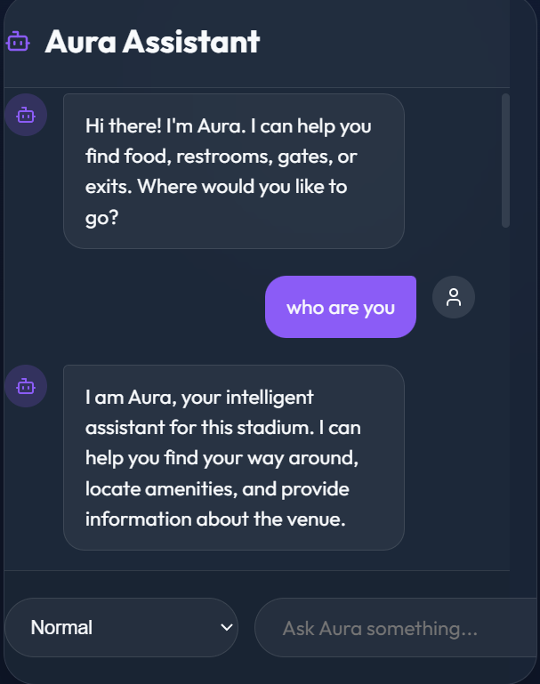
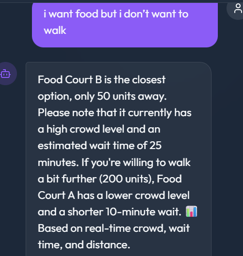
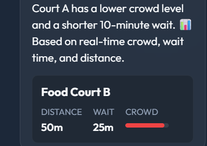
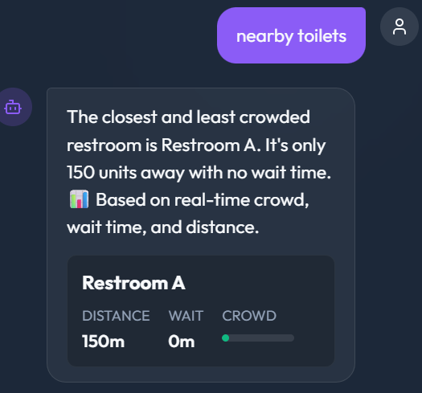

# 🤖 Aura – Intelligent Crowd-Aware Navigation Assistant

# 🚀 Overview

Aura is an AI-powered smart navigation assistant designed for crowded environments like stadiums, malls, and airports.

It helps users make better real-time decisions by combining:

📊 Live crowd data

⏱️ Wait time

📍 Distance

🧠 AI reasoning (Gemini)

Aura processes natural language queries like:

“I’m hungry but don’t want to walk”

and returns context-aware, optimized recommendations instantly.

# 🎯 Problem Statement

In large public spaces, users struggle with:

❌ Choosing between multiple options (food, restrooms, exits)

❌ Avoiding crowded or high-wait areas

❌ Making quick decisions under time pressure

❌ Lack of intelligent guidance systems

# Existing solutions:

Show static maps

Don’t adapt to user intent

Don’t consider real-time conditions

# 💡 Solution

Aura introduces a hybrid intelligence system:

🧠 Dual Decision Engine:

⚙️ Rule-based logic → fast + deterministic

🤖 AI reasoning (Gemini) → flexible + human-like

🔥 What it does:

Understands natural language queries

Detects user intent (fast / lazy / urgent / avoid)

Evaluates zones using:

wait time

distance

crowd level

Recommends best or worst zones

Falls back to AI when logic is insufficient

# 🏗️ Architecture

User Input (Frontend Chat UI)

        ↓
        
Express Backend (/chat API)

        ↓
        
Decision Engine (Logic Layer)

        ↓
        
   ↙           ↘
   
Logic Engine    Gemini AI (Fallback / Enhancement)

        ↓
        
Firestore (Zones Data)

        ↓
        
Response (Recommendation + Explanation)

# ⚙️ Tech Stack

🖥️ Backend

Node.js

Express.js

🧠 AI

Google Generative AI (Gemini 2.5 Flash)

🗄️ Database

Google Firestore

🌐 Frontend

React.js

☁️ Cloud

Google Cloud Platform

# ✨ Features

✅ Natural Language Understanding

→ “I want food but don’t want to walk”

✅ Intelligent Decision Engine

→ Balances wait time, distance, and crowd

✅ Dynamic Priority Detection

→ Detects intent like:

fast → low wait

lazy → low distance

avoid → worst zones

✅ AI + Logic Hybrid System

→ Logic for speed, AI for flexibility

✅ Explainable Responses

→ Always tells WHY a zone is recommended

✅ Smart Avoidance System

→ Suggests which areas to avoid

✅ Real-Time Simulation

→ Crowd + wait prediction logic

✅ Robust Fallback Handling

→ Never crashes, always responds

# 🧠 AI Integration

Model Used:
👉 gemini-2.5-flash

Where AI is used:

Non-zone queries (e.g. “who are you”)

Complex multi-intent queries

Enhancing logic responses

What AI does:

Understands intent

Generates human-like responses

Selects best zone when logic is uncertain

# 📂 Project Structure

AURA_agent/

├── backend/

│   ├── routes/api.js

│   ├── services/

│   │   ├── decisionEngine.js

│   │   ├── vertex.js

│   │   └── firebase.js

│   ├── server.js

│   └── scripts/

│

├── frontend/

│   ├── components/

│   ├── App.jsx

│   └── main.jsx

│

├── .env

├── package.json

└── README.md

# 💻 How to Run Locally

1️⃣ Clone Repository

git clone https://github.com/your-username/aura.git

cd aura

2️⃣ Backend Setup

cd backend

npm install

3️⃣ Create .env

GOOGLE_API_KEY=your_api_key_here

4️⃣ Run Backend

node server.js

5️⃣ Run Frontend

cd ../frontend

npm install

npm run dev

# ⚠️ Limitations

Uses simulated crowd data (not real sensors)

No real-time map visualization

Single-user environment

AI responses depend on API availability

# 🔮 Future Improvements

🗺️ Real-time map integration

📡 Live crowd tracking via IoT

📅 Personalized recommendations

📊 Analytics dashboard

🔔 Notifications & alerts

🧠 Reinforcement learning optimization

# 🏁 Why Aura Stands Out

Unlike traditional systems, Aura:

✔ Combines AI + deterministic logic

✔ Provides explainable recommendations

✔ Adapts to user intent dynamically

✔ Works as a true conversational assistant

# 🚀 Demo

