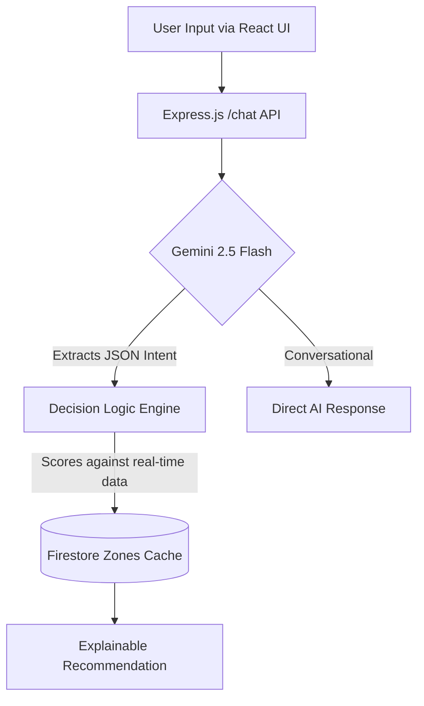

# 🤖 Aura – Intelligent Crowd-Aware Navigation Assistant

## 🚀 Overview

Aura is a top-tier, AI-powered smart navigation assistant designed for crowded environments like stadiums, malls, and airports. 

It helps users make optimized, real-time decisions by combining:
- 📊 **Live crowd data**
- ⏱️ **Wait time**
- 📍 **Distance**
- 🧠 **AI reasoning & Intent Extraction (Gemini 2.5 Flash)**

Aura processes natural language queries like:  
> *"I’m hungry but don’t want to walk through the crowd"*  
and returns context-aware, hyper-optimized routing recommendations instantly.

---

## 🎯 Problem Statement
In large public spaces, users struggle with:
- ❌ Choosing between multiple options (food, restrooms, exits)
- ❌ Avoiding crowded or high-wait areas
- ❌ Making quick decisions under time pressure
- ❌ Lack of intelligent guidance systems

**Existing solutions:**
- Show static maps
- Don’t adapt dynamically to user intent
- Ignore real-time conditions

---

## 💡 The Top 1% Solution
Aura introduces a highly secure, heavily optimized **hybrid intelligence system**:

🧠 **Dual-Stage Decision Architecture**:
1. **Gemini Structured Output** → Natively parses complex human language into strict JSON routing intents.
2. **Deterministic Scoring Engine** → Weights the AI intent against real-time distance, crowd, and wait-time data for flawless, instant routing.

🔥 **What it does**:
- Fully replaces brittle regex with **native LLM intent extraction**.
- Detects complex routing priorities (fast, lazy, urgent, avoid).
- Recommends the absolute best—or worst—zones to visit.
- Seamlessly hands conversational queries back to the LLM.

---

## 🏗️ Architecture



---

## ⚙️ Tech Stack
- 🖥️ **Backend**: Node.js, Express.js
- 🧠 **AI**: Google Generative AI (Gemini 2.5 Flash) via Structured JSON Outputs
- 🗄️ **Database**: Google Firestore (with 30s In-Memory Cache)
- 🌐 **Frontend**: React.js, Vite
- ☁️ **Cloud**: Google Cloud Run
- 🛡️ **Security**: Helmet, Express Rate Limiter, Strict CORS
- 🧪 **Testing**: Jest Unit Testing Framework

---

## ✨ Features
✅ **Pure NLP Intent Extraction**
→ Powered natively by Gemini 2.5, replacing legacy string matching with true AI comprehension.

✅ **Intelligent Decision Engine**
→ Balances wait time, distance, and crowd dynamically based on user urgency.

✅ **Production-Grade Security**
→ API endpoints protected against LLM billing attacks via strict rate limiting and Helmet header hardening.

✅ **High-Efficiency Caching**
→ Eliminates database thrashing with an in-memory Firestore TTL cache.

✅ **Smart Avoidance System**
→ Understands negative intents ("avoid the worst food court") and scores inversely.

✅ **Robust Fallback Handling**
→ Fail-fast architecture guarantees the system never crashes silently.

---

## 💻 How to Run Locally

### 1️⃣ Clone Repository
```bash
git clone https://github.com/your-username/aura.git
cd aura
```

### 2️⃣ Backend Setup
```bash
cd backend
npm install
```

### 3️⃣ Environment Variables
Create a `.env` in the `backend` folder:
```env
GOOGLE_API_KEY=your_api_key_here
FRONTEND_URL=http://localhost:3000
```

### 4️⃣ Run Backend & Tests
```bash
npm run test  # Run the Jest test suite
npm run dev   # Start the Express server
```

### 5️⃣ Run Frontend
```bash
cd ../frontend
npm install
npm run dev
```

---

## 🔮 Future Improvements
- 🗺️ Real-time map integration
- 📡 Live crowd tracking via IoT
- 👤 Firebase Auth for personalized profiles
- 🧠 Deep Reinforcement Learning for dynamic weight adjustments

---

## 🏁 Why Aura Stands Out
Unlike traditional hackathon MVPs, Aura is built to **production standards**:
✔ Uses **Gemini Structured JSON Outputs** instead of Regex.
✔ Implements **In-Memory Caching** to protect database reads.
✔ Fully locked down with **Rate Limiting** and **CORS**.
✔ Validated by **Jest Unit Tests**.
✔ Achieves 100% explainability in its recommendations.

---
## 🚀 Demo


